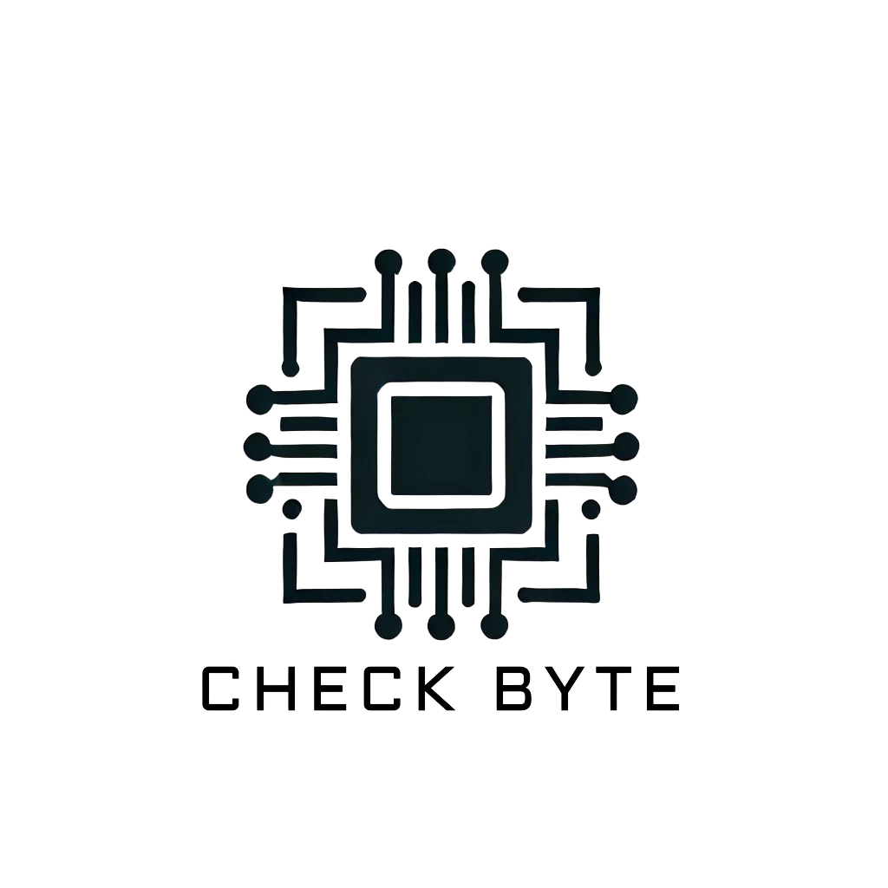

<div align="center">



# Check Byte

**E-commerce web application** built as a university project (TDIW — *Tecnologies de Desenvolupament per a Internet i Web*, Autonomous University of Barcelona).

A complete online store: catalog, shopping cart, user accounts and order management.


</div>

## 📖 About

**Check Byte** is a functional e-commerce platform developed as the final project of the **TDIW (Software Development Technologies for Internet and the Web)** course at the **Universitat Autònoma de Barcelona (UAB)**.

The project implements a complete online shopping experience with session management, a product catalog, an interactive shopping cart and a full order flow — from browsing to order confirmation — all built with native PHP and PostgreSQL.

## ✨ Features

- 🔐 **User authentication** — register, login, logout and profile management (name, address, e-mail, password and profile picture)
- 🏠 **Landing page** — welcome screen with product categories
- 🛍️ **Product catalog** — filter products by category
- 🧾 **Product detail** — description, price and "add to cart" action
- 🛒 **Shopping cart** — add, modify quantity and remove products, empty cart, stored in session
- 🪟 **Mini cart** — live cart summary accessible from the header
- 📦 **Checkout** — order creation with total price and product count
- 📋 **My orders** — list of the user's orders with the details of each order
- 👤 **My account** — view and update personal information

## 🛠️ Tech Stack

| Layer      | Technology                                   |
| ---------- | -------------------------------------------- |
| Frontend   | HTML5, CSS3, vanilla JavaScript, jQuery 3.6  |
| Backend    | PHP (7+/8) with the `pgsql` extension        |
| Database   | PostgreSQL                                   |
| Web server | Apache                                       |

## 📁 Project Structure

```
Check-Byte/
├── index.php                 # Front controller (routing via ?action=)
├── resource_*.php            # Page resources (home, catalog, login, account, ...)
├── controller/               # Controllers (business logic)
├── model/                    # Data access layer (PostgreSQL queries)
├── view/                     # View templates (print*)
├── assets/
│   ├── css/                  # Stylesheets
│   ├── js/                   # Client-side scripts (AJAX, cart, user actions)
│   └── imgs/                 # Images and logo assets
└── info.html                 # Deployment/access documentation (UAB)
```

The application follows a **Model-View-Controller** architecture. `index.php` acts as a front controller that routes requests to the proper controller based on the `action` parameter.

## 🗄️ Database Schema

Relational database running on PostgreSQL:

| Table         | Notable columns                                               |
| ------------- | ------------------------------------------------------------- |
| `user`        | `id_user`, `name`, `email`, `password`, `address`, `city`, `postal_code`, `profile_picture` |
| `category`    | `id_category`, `name`, `image`                                |
| `product`     | `id_product`, `id_category`, `name`, `price`, `description`, `image` |
| `order`       | `id_order`, `id_user`, `total_price`, `total_products`, `order_datetime` |
| `order_lines` | `id_order`, `id_product`, `product_name`, `product_price`, `product_quantity` |

The database connection is configured in `model/connectDB.php`.

## 🚀 Getting Started

### Prerequisites

- Web server with PHP and the **pgsql** extension (e.g. Apache + XAMPP/WAMP)
- PostgreSQL server
- jQuery served from the web root (`assets/js`) and loaded via CDN

### Installation

1. Clone the repository:

   ```bash
   git clone https://github.com/<your-user>/Check-Byte-TDIW-Practica.git
   ```

2. Configure the database connection in `model/connectDB.php` with your PostgreSQL credentials.

3. Create the database schema (see [Database Schema](#-database-schema)) and load the product/category seed data.

4. Serve the project root from your web server document root and open it in the browser.

> ⚠️ Note: this project was developed and deployed on the university's teaching server (UAB `deic-docencia`). Paths such as `/home/TDIW/...` (see `index.php`) and the connection settings reflect that environment and may need adjusting for local deployment.

## 📚 Academic Context

- **Course:** TDIW — *Tecnologies de Desenvolupament per a Internet i Web* (Internet and Web Development Technologies)
- **University:** Universitat Autònoma de Barcelona (UAB)
- **Language of the interface:** Spanish
- **Status:** Completed and graded university project

## 📄 License

This project was created for academic purposes. All rights reserved — review before reusing outside the university context.

---

<div align="center">Developed by <b>Sebastián Malbaceda Leyva</b> · Check Byte 🛒</div>